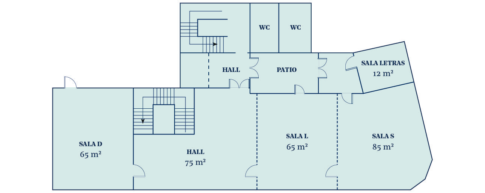
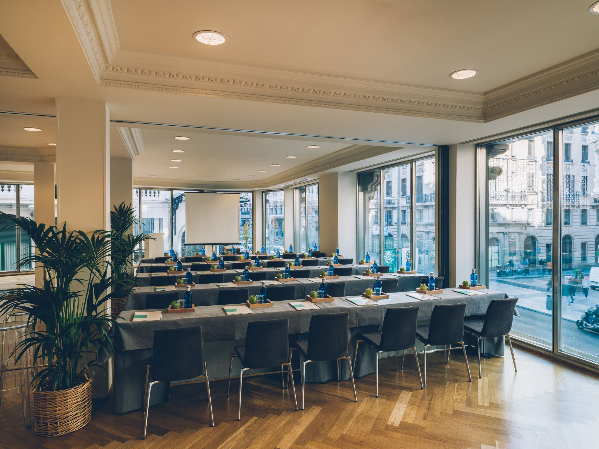
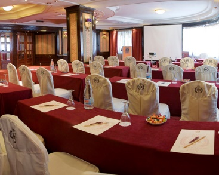

<style>
.list-group-item.active, .list-group-item.active:focus, .list-group-item.active:hover {
    background-color: #EA5933;
}
</style>

<style>
.nav>li>a {
    position: relative;
    display: block;
    padding: 10px 15px;
    color: #EA5933;
    font-weight: bold;
}
.nav-pills>li.active>a, .nav-pills>li.active>a:hover, .nav-pills>li.active>a:focus {
    color: white;
    background-color: #EA5933;
}
</style>

<style>

.precio{
background-color:#828282;
color: white;
padding: 10px;
border: 1px solid black;
margin-left: 5px;
border-radius: 5px;
}
</style>

<br>


<script> 
    $(document).ready(function() { 
    $head = $('#header'); 
    $head.prepend('<A href = https://www.cuttingedge-events.com></A>') 
    }); 
</script> 


```{r echo=FALSE, message=FALSE,warning=FALSE}
library(readxl)
library(dplyr)
library(knitr)
```


# Programme

<iframe src="timeline.html" frameborder="0" width="100%" height="1300" scrolling="no"></iframe>


# Map

<iframe src="https://www.google.com/maps/d/embed?mid=1grMymwodaN783GnT0kldqKQU67hdzdc6&hl=es"  width="100%" height="480"></iframe>

</br>


# Hotel Options {.tabset .tabset-fade .tabset-pills}

## Iberostar Las Letras

<iframe src="LasLetras/LasLetras.html" frameborder="0" width="100%" height="1500" scrolling="no"></iframe>

</br>

**Meeting Facilities**

The plenary room that Oticon would use is S+L

</iframe>

</iframe>

</br>


## Hotel Emperador

<iframe src="Emperador/Emperador.html" frameborder="0" width="100%" height="1400" scrolling="no"></iframe>

</br>

Hotel Emperador's plenary meering room has natural light 

</iframe>

</br>

# June 17th Dinner

<iframe src="CafedeOriente/CafedeOriente.html" frameborder="0" width="100%" height="1250" scrolling="no"></iframe>


<div class="precio">
<p> Rates: 
  <ul>
  * Dinner menu including starters to share, main course, dessert, drinks (1 bottle of wine each 3 pax and water) and Coffee, from: 52€ VAT inc

   </ul>
</p>
</div>

</br>
</br>


## Other restaurant options {.tabset .tabset-fade .tabset-pills}

### Sin Sombrero

<iframe src="SinSombrero/SinSombrero.html" frameborder="0" width="100%" height="1200" scrolling="no"></iframe>

</br>

<div class="precio">
<p> Rates: 
  <ul>
  * Dinner menu including starters to share, main course, dessert, drinks (unlimited until dessert) and Coffee, from: 62€ VAT inc

   </ul>
</p>
</div>


### Serafina

<iframe src="Serafina/Serafina.html" frameborder="0" width="100%" height="1450" scrolling="no"></iframe>

</br>

<div class="precio">
<p> Rates: 
  <ul>
  * Dinner menu including starters to share, main course, dessert, drinks (1 bottle of wine each 3 pax and water) and Coffee, from: 48€ VAT inc

   </ul>
</p>
</div>


# June 18th - Flamenco night {.tabset .tabset-fade .tabset-pills}

## Tablao Villa Rosa

<iframe src="TablaoVillaRosa/TablaoVillaRosa.html" frameborder="0" width="100%" height="1250" scrolling="no"></iframe>

</br>

<div class="precio">
<p> Rates: 
  <ul>
  * Dinner menu including starters to share, main course, dessert, drinks (1 bottle of wine each 3 pax and water) and Coffee - Including the Flamenco Show, from: 95€ VAT inc

   </ul>
</p>
</div>

</br>
</br>
**Virtural tour**

<iframe src="https://www.google.com/maps/embed?pb=!4v1576152233325!6m8!1m7!1sCAoSLEFGMVFpcFBLR2g0aTNuMm5QeUlFRXI4X0dfU0tFNExnUzFJd3lDR3B1SWI3!2m2!1d40.41496978796467!2d-3.701347978186732!3f276.86!4f-8.040000000000006!5f0.7820865974627469" width="100%" height="450" frameborder="0" style="border:0;" allowfullscreen=""></iframe>

## Corral de la Moreria

<iframe src="CorralDeLaMoreria/CorralDeLaMoreria.html" frameborder="0" width="100%" height="1200" scrolling="no"></iframe>

</br>

<div class="precio">
<p> Rates: 
  <ul>
  * Dinner menu including starters to share, main course, dessert, drinks (1 bottle of wine each 3 pax and water)  Including the Flamenco Show, from: 120€ VAT

   </ul>
</p>
</div>

</br>
</br>

# Budget {.tabset .tabset-fade .tabset-pills}

## Las Letras

<iframe src="budgetlasletras.html" frameborder="0" width="100%" height="2300" scrolling="no"></iframe>

</br>

## Emperador

<iframe src="budgetemperador.html" frameborder="0" width="100%" height="1500" scrolling="no"></iframe>

</br>


# TERMS AND CONDITIONS

  * Rates valid for Oticon Seminar - June 2020
  
  * For a group of minimum 35 pax.
  
  * Cutting Edge Events management fee including in the detailed rates
  
  * VAT included. 
  
  * No reservation has been done. Availability upon request.
  
*****


